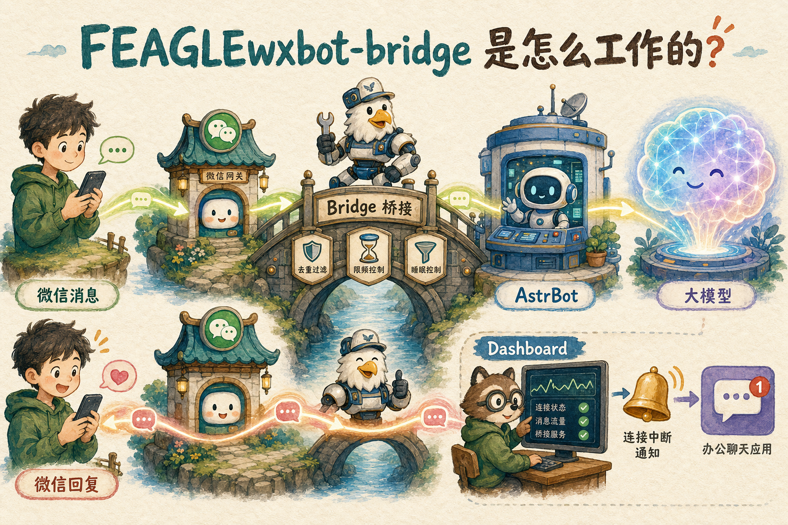

# FEAGLE WxBot Bridge

一个可自托管的微信 AI 机器人桥接项目：



```text
微信 / Wechat4u → FEAGLE Bridge → OneBot v11 → AstrBot → 大模型
```

项目使用 Docker Compose 启动一个独立的机器人容器，内置：

- Wechat4u 微信 Web 协议客户端
- OneBot v11 反向 WebSocket 桥接
- AstrBot 与 OpenAI-compatible 大模型配置
- 中英双语 Dashboard：二维码、日夜主题、连接状态、消息概览和控制工具
- 微信协议心跳、Session 恢复和自动重连
- 可持久化的暂停回复与管理员紧急离线
- 私聊与群聊消息限流、长度限制、持久化去重和并发熔断
- 群聊硬闸门：默认关闭、仅观察、白名单群内仅被 `@` 时回复
- 群/成员双层频率限制、回复抖动与按群自动熔断
- 可在 Dashboard 配置的本地双向文字策略
- `00:00-07:00` 默认休眠时段
- 可选飞书私聊掉线、二维码和恢复通知

> [!WARNING]
> Wechat4u 使用微信 Web 协议，可能受到微信登录策略和风控限制。请使用你能承担掉线或限制风险的账号；本项目不保证协议长期可用。

## 安全设计

公开仓库不包含也不需要提交以下内容：

- 大模型 API Key
- 飞书 App Secret 或用户 `open_id`
- 微信 Cookie、Session 和二维码
- 联系人、消息 ID 映射和 AstrBot 会话数据库
- 服务器 IP、SSH 密码或私钥

这些内容只写入本机 `.env` 或 `data/`，均已由 `.gitignore` 排除。Dashboard 和 AstrBot WebUI 默认只监听宿主机 `127.0.0.1`，无需开放公网端口。

## 环境要求

- Linux x86_64（主要测试环境为 Ubuntu）
- Docker Engine
- Docker Compose v2
- `curl`、`tar`
- 推荐至少 2 GB 内存和 10 GB 可用磁盘

## 快速开始

```bash
git clone https://github.com/Wdclouds/FEAGLEwxbot-bridge.git
cd FEAGLEwxbot-bridge
chmod +x wxbot-bridge scripts/*.sh
./wxbot-bridge setup
```

安装向导会逐项完成：

1. 检查 Docker、Compose、CPU 架构和端口。
2. 选择 DeepSeek、OpenAI-compatible 接口或暂不配置模型。
3. 安全输入 API Key，不在终端回显。
4. 设置时区和机器人休眠时段。
5. 可选配置飞书私聊通知。
6. 下载固定版本的 AstrBot。
7. 构建并启动机器人，等待健康检查。

如需在任意目录直接输入 `wxbot-bridge`，执行：

```bash
sudo ./scripts/install-command.sh
wxbot-bridge
```

## 常用命令

```bash
./wxbot-bridge setup
./wxbot-bridge doctor
./wxbot-bridge start
./wxbot-bridge stop
./wxbot-bridge restart
./wxbot-bridge status
./wxbot-bridge logs
```

不带参数运行会显示交互菜单：

```bash
./wxbot-bridge
```

## 打开 Dashboard

项目不会把管理端口暴露到公网。在自己的电脑上建立 SSH 隧道：

```bash
ssh \
  -L 6190:127.0.0.1:6190 \
  -L 6185:127.0.0.1:6185 \
  root@your-server
```

保持 SSH 窗口开启，然后访问：

- FEAGLE Dashboard：<http://127.0.0.1:6190>
- AstrBot WebUI：<http://127.0.0.1:6185>

首次启动时，Dashboard 会显示微信登录二维码。扫码并在手机确认后，状态应依次变为 `ONLINE / HEALTHY`、AstrBot `READY`、OneBot `CONNECTED`。

### Windows 后台隧道命令

Windows 用户可以安装仓库附带的命令助手，SSH 地址只写入本机配置，不会提交到仓库：

```powershell
powershell -ExecutionPolicy Bypass -File .\scripts\windows\install.ps1 `
  -SshTarget root@your-server
```

重新打开 PowerShell 或 CMD 后使用：

```powershell
wxbot bridge start
wxbot bridge status
wxbot bridge exit
```

`start` 会通过 SSH 密钥在后台建立 Dashboard 与 AstrBot WebUI 隧道；`exit` 只会终止它自己记录的 SSH 进程，不会关闭其他 SSH 会话。PID 和本机日志保存在 `%LOCALAPPDATA%\FEAGLEwxbot\`，其中不保存 SSH 密码或私钥。

Dashboard 提供三种管理员运行状态：

- `RUNNING`：正常接收并回复消息。
- `PAUSED`：保持微信 Session 和协议心跳，但丢弃新消息、不调用模型。
- `MANUAL_OFFLINE`：主动退出微信，停止自动重连和二维码通知；容器重启后仍保持离线，直到管理员点击恢复。

“强制重登测试”与“紧急离线”是两种不同操作。前者用于验证扫码和飞书通知链路；后者用于需要机器人立即安静下线的场景。同一次异常或登录流程最多向飞书推送一次二维码，二维码自动刷新不会反复打扰。

群聊另有一套独立、默认关闭的安全闸门：

- `OFF`：群消息不会进入 AstrBot，也不会调用模型。
- `OBSERVE`：只在本地 Dashboard 显示消息概览，不进入 AstrBot、不回复。
- `MENTION_ONLY`：只有群数字 ID 已加入白名单，并且消息明确 `@` 机器人时，才会转发给 AstrBot。白名单为空时保持零群回复。

群聊回复还受以下保护：

- 每个群成员默认每分钟最多进入模型 3 次，每个群合计最多 6 次。
- OneBot 全局并发门、每群 5 秒发送冷却、模型回复最多 1000 字。
- 发送前增加可配置的 1–3 秒随机抖动；它用于平滑发送节奏，不承诺规避微信风控。
- Dashboard 可配置本地字面量拦截词，入站提示词和模型出站回复都会检查。默认词表为空，项目不内置或声称提供完整的合规词库。
- 同一群 5 分钟内连续 3 次处理/发送失败，或 1 分钟内累计 12 次频率异常，会单独熔断 15 分钟并发送飞书告警；私聊和其他群不受影响。

所有阈值都可通过 `.env` 调整。Dashboard 切换到 `MENTION_ONLY` 时仍要求二次确认。

## 可选 Android Agent 接入

项目支持把底层微信连接从 Wechat4u 切换为 Android Agent，Bridge、
OneBot、AstrBot、模型、限流、休眠时段和持久化 ID 映射继续复用：

```text
Wechat4u ───────┐
                ├─→ FEAGLE Bridge → OneBot v11 → AstrBot
Android Agent ──┘
```

两个 transport 是并列选择，不应同时消费同一账号。当前已验证的 Android 主链路
锁定微信 `8.0.70`，由版本化 Hook 适配器捕获私聊文本并通过 Binder 交给独立
Agent；系统通知适配器保留为受限兜底。Agent 持久队列、WebSocket ACK 和服务器
SQLite 收据共同避免断线重放。远程传输可选择标准 WSS，或只绑定 Tailscale 私网。

详细的构建、Token、WSS 反向代理和切换方式见
[Android Agent 文档](./android/README.md)。

## 飞书私聊通知

飞书通知是可选功能。需要创建企业自建应用并配置：

- 机器人能力
- 长连接事件订阅
- `im.message.receive_v1`
- 私聊消息读取与机器人发消息相关权限

发布应用后，在飞书中私聊机器人发送：

```text
绑定
```

绑定成功后，微信意外掉线、登录二维码和恢复结果会发送到该私聊。管理员主动紧急离线不会触发故障或二维码通知。仓库不会保存或上传你的邮箱、手机号等个人资料。

## 文件结构

```text
.
├── bot/
│   ├── src/                  # 微信、OneBot、AstrBot 与 Dashboard
│   ├── test/                 # Node.js 自动化测试
│   ├── Dockerfile
│   └── package.json
├── scripts/
│   ├── doctor.sh             # 部署前检查
│   ├── check-secrets.sh      # 提交前隐私与密钥检查
│   ├── fetch-astrbot.sh      # 获取固定 AstrBot 版本
│   ├── install-command.sh    # 安装全局命令
│   ├── setup.sh              # 首次配置向导
│   └── wait-ready.sh         # 启动健康检查
├── .env.example
├── docker-compose.yml
└── wxbot-bridge
```

## 数据与备份

运行数据位于 `./data/`。备份时至少保留：

```text
data/
.env
```

管理员运行状态、群聊模式、群白名单和本地拦截词保存在 `data/control-state.json`，不包含账号或密钥。消息 ID 收据保存在本地 SQLite 中，用于阻止 Session 恢复或容器重启后的旧消息重复回复。

不要把它们上传到 GitHub、网盘公开链接或聊天记录。迁移服务器时，应通过加密通道传输。

## 当前范围

当前重点是：

- 私聊文本接收与回复
- 群消息仅观察，以及白名单群内被 `@` 后的文本回复
- Docker 单机部署
- 本地管理面板
- 微信会话自愈
- 飞书私聊通知

图片、文件、更完整的群成员资料、更多模型供应商和完整的一键升级流程会在后续版本逐步完善。

## 已知限制

- 当前群聊只支持文本；群文件、图片和引用消息不会转发。
- Wechat4u 的群成员资料可能不完整，OneBot 群成员查询仅返回桥接层已经见过的基础信息。
- Wechat4u 上游版本较旧，微信接口变化可能造成登录或联系人接口异常。
- OpenAI-compatible 自定义接口只负责生成 AstrBot 基础配置，个别供应商可能仍需在 WebUI 调整参数。

## 上游项目

- [AstrBot](https://github.com/AstrBotDevs/AstrBot)
- [Wechat4u](https://github.com/nodeWechat/wechat4u)
- [OneBot 11](https://github.com/botuniverse/onebot-11)

本项目不是微信、腾讯、AstrBot 或飞书的官方项目。

## 许可证

仓库目前尚未选择开源许可证。在许可证确定前，代码可供查看和测试，但请勿假定获得再分发或商业使用授权。
